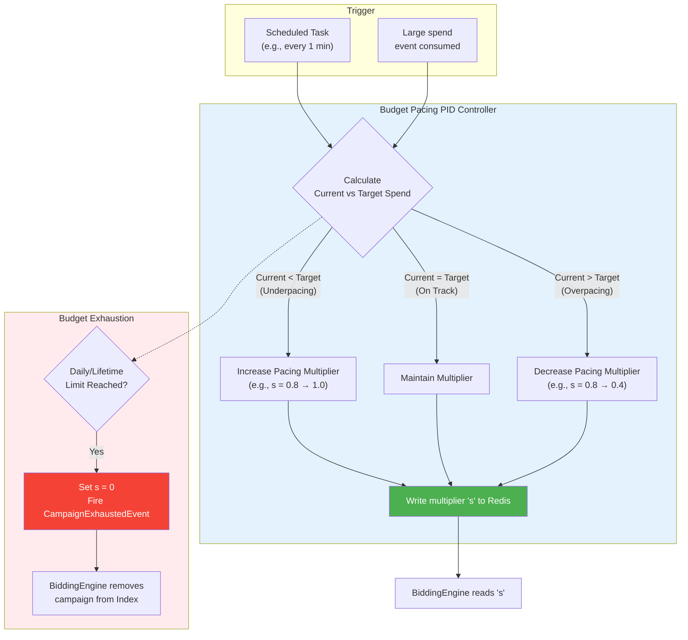

# Budget Limiting & Pacing Service (BudgetLimitingService)

## Overview
The `BudgetLimitingService` (formerly Budget Pacing Service) is responsible for ensuring that advertising campaigns spend their allocated budgets evenly over time (pacing) and do not exceed their daily or lifetime limits. It achieves this by continuously calculating a pacing multiplier $s \in [0,1]$ for each campaign, which the `BiddingEngine` uses to modulate bid aggressiveness.

## Core Responsibilities
- **Asynchronous Control Loop**: Continuously monitors each campaign's spend depletion rate versus the time-of-day in a background thread.
- **Probabilistic Budget Pacing Algorithm**: Dynamically calculates the pacing multiplier $s$ to ensure steady budget consumption. Without pacing, campaigns would deplete their budgets entirely in the first few hours of the morning, missing highly valuable afternoon/evening impressions. The mathematical objective is to find the exact value of $s$ such that the **expected cumulative spend equals the total allocated budget**.
- **CTR Prediction** — *design intent, not built.* There is no model and no inference call. The former
  `CTRPredictionModel` returned `Math.random()` and was deleted rather than left to look real.
- **Pacing Multiplier Updates**: Emits updated multipliers (`$0.01` to `$1.00`) directly to the `BiddingEngine`'s Redis cache for low-latency retrieval.

## Budget Pacing — Async Control Loop
The pacing algorithm continuously regulates spend. It operates out-of-band to ensure the RTB auction path is never slowed down.

## Resilience & Edge Cases
- **Overspending Prevention**: Strictly guards against over-delivery (spending beyond the advertiser's budget). The platform absorbs any overspend caused by delayed processing.
- **Micro-burst Protection**: Employs rapid recalibration if a sudden influx of traffic causes a micro-burst in spend, rapidly decaying the $s$ multiplier.
- **Circuit Breaking**: The CampaignService budget lookup is guarded by a Feign fallback
  (`CampaignClientFallback`), so a failure there degrades to safe default pacing rather than blocking
  bidding. The service has no time-series database and no ML model to fail.
